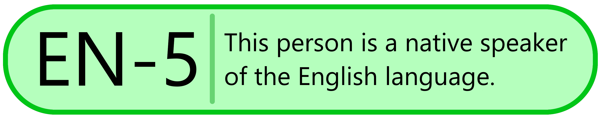
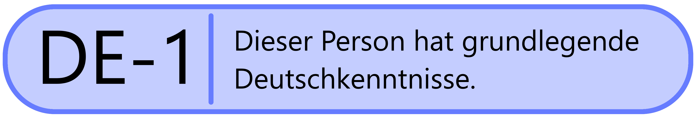
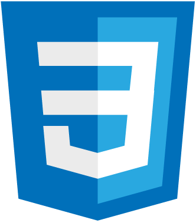
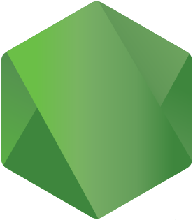
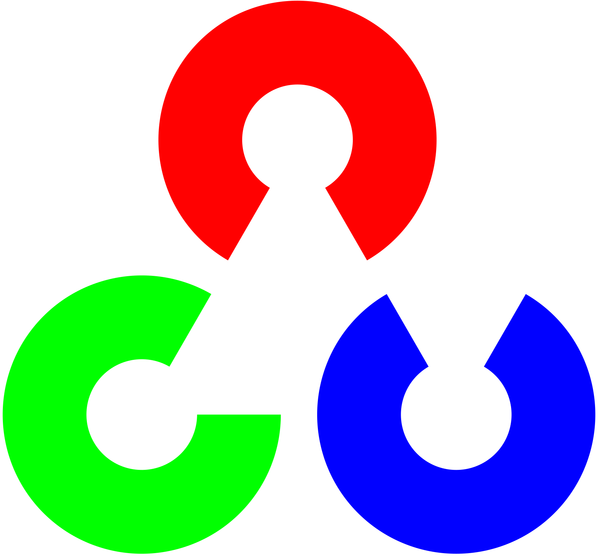

<h1>  Hello!</h1>

  My name is Zachary Bratten. I am working towards a Computer Science major.

<picture>
  <source srcset="icons/FIRSTAlumn-Dark.png" media="(prefers-color-scheme: dark)"/>
  <source srcset="icons/FIRSTAlumn-Light.png" media="(prefers-color-scheme: light), (prefers-color-scheme: no-preference)"/>
  
</picture>
<picture>
  
</picture>
<picture>
  
</picture>

<b>Knowledgeable In:</b>

  
  
  
  
  
  
  &nbsp;&nbsp;&nbsp;
  
  &nbsp;&nbsp;&nbsp;
  

<b>Learning:</b>

  
  
  
  
  
  &nbsp;&nbsp;&nbsp;
  
  &nbsp;&nbsp;&nbsp;
  
  
  
  
  
  

<b>Dabbled In:</b>

  
  
  
  

<b>More About Me:</b>
<ul>
  <li>I am a huge Undertale/Deltarune fan.</li>
  <li>I have been programming since 2012.</li>
  <li>My coding style is K&R.</li>
  <li>I was on a FIRST Tech Challenge <a href="https://www.lectriclegends.org" target="_blank">robotics team</a> for 5 years.</li>
  <li>I was on a 4-H robotics team for 5 years.</li>
</ul>

<picture>
  <source srcset="https://github-readme-stats.vercel.app/api?username=thegreatonenamedzach&custom_title=GitHub%20Stats&show_icons=true&theme=dark" media="(prefers-color-scheme: dark)"/>
  <source srcset="https://github-readme-stats.vercel.app/api?username=thegreatonenamedzach&custom_title=GitHub%20Stats&show_icons=true" media="(prefers-color-scheme: light), (prefers-color-scheme: no-preference)"/>
  
</picture>
<picture>
  <source srcset="https://github-readme-stats.vercel.app/api/top-langs/?username=thegreatonenamedzach&custom_title=Languages%20Used%20On%20GitHub&layout=compact&langs_count=8&theme=dark" media="(prefers-color-scheme: dark)"/>
  <source srcset="https://github-readme-stats.vercel.app/api/top-langs/?username=thegreatonenamedzach&custom_title=Languages%20Used%20On%20GitHub&layout=compact&langs_count=8" media="(prefers-color-scheme: light), (prefers-color-scheme: no-preference)"/>
  
</picture>

<picture>
  <source srcset="https://github-readme-stats.vercel.app/api/wakatime?username=thegreatonenamedzach&custom_title=Programming%20Stats%20(last%20365%20days)&layout=compact&theme=dark" media="(prefers-color-scheme: dark)"/>
  <source srcset="https://github-readme-stats.vercel.app/api/wakatime?username=thegreatonenamedzach&custom_title=Programming%20Stats%20(last%20year)&layout=compact" media="(prefers-color-scheme: light), (prefers-color-scheme: no-preference)"/>
  
</picture>

<picture>
  <source srcset="https://roadmap.sh/card/tall/665affe4b998f3b3c72bdb43?variant=dark&roadmaps=computer-science%2Cfull-stack%2Ccyber-security%2Cjava" media="(prefers-color-scheme: dark)"/>
  <source srcset="https://roadmap.sh/card/tall/665affe4b998f3b3c72bdb43?variant=light&roadmaps=computer-science%2Cfull-stack%2Ccyber-security%2Cjava" media="(prefers-color-scheme: light), (prefers-color-scheme: no-preference)"/>
  
</picture>
