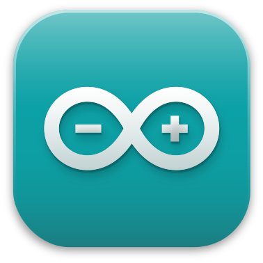

#  Hello!
My name is Zachary Bratten. I am working towards a Computer Science major at the University of Kentucky.

<picture>
  <source srcset="icons/FIRSTAlumn-Dark.png" media="(prefers-color-scheme: dark)"/>
  <source srcset="icons/FIRSTAlumn-Light.png" media="(prefers-color-scheme: light), (prefers-color-scheme: no-preference)"/>
  
</picture>

---

**Knowledgeable In:**

**Learning:**

**Dabbled In:**

---

**More About Me:**
* I am a huge Undertale/Deltarune fan.
* I have been programming since 2012.
* I was on a FIRST Tech Challenge [robotics team](https://www.lectriclegends.org) for 5 years.
* I was on a 4-H robotics team for 5 years.

---

<picture>
  <source srcset="https://github-readme-stats.vercel.app/api?username=thegreatonenamedzach&custom_title=GitHub%20Stats&show_icons=true&theme=dark" media="(prefers-color-scheme: dark)"/>
  <source srcset="https://github-readme-stats.vercel.app/api?username=thegreatonenamedzach&custom_title=GitHub%20Stats&show_icons=true" media="(prefers-color-scheme: light), (prefers-color-scheme: no-preference)"/>
  
</picture>
<picture>
  <source srcset="https://github-readme-stats.vercel.app/api/top-langs/?username=thegreatonenamedzach&layout=compact&langs_count=8&theme=dark" media="(prefers-color-scheme: dark)"/>
  <source srcset="https://github-readme-stats.vercel.app/api/top-langs/?username=thegreatonenamedzach&layout=compact&langs_count=8" media="(prefers-color-scheme: light), (prefers-color-scheme: no-preference)"/>
  
</picture>

